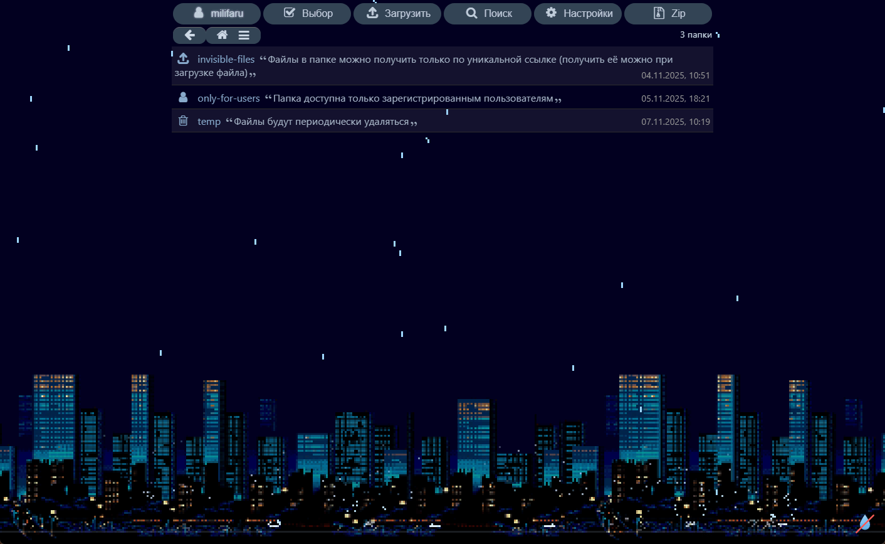

# Retro Rain for HFS

Retro Rain is a visual / interactive theme plugin for [HTTP File Server (HFS) 3.x](https://rejetto.com) created by [Milifaru](https://github.com/Milifaru). It renders a pixel-art rain effect over the page, supports extensive styling controls, and ships with an arcade mini‑game plus online leaderboard integration.

## Features

- **Dynamic rain renderer** with configurable pixel size, gravity, wind, spawn caps, edge spawning, and background image handling.
- **UI theming hooks** that recolor top menus, breadcrumbs, and file listings to blend with the retro aesthetic.
- **Leaderboard + API helpers** (`serverLoadScores` / `serverSaveScore`) ready for HFS custom REST endpoints.
- **Safe toggles** for precipitation and page overlays, including keyboard handling and accessibility fallbacks.

## Repository Layout

```
retro-rain/
├─ dist/                  # Files that HFS installs
│  ├─ plugin.js           # HFS manifest + backend code
│  └─ public/
│     ├─ rain.js          # Client-side renderer, mini-game, UI logic
│     ├─ rain.css         # Optional CSS helpers
│     └─ fon.png          # Default background image
├─ docs/
│  ├─ dev-plugins.md      # Snapshot of official publishing guide
│  └─ PUBLISHING.md       # Repo-specific instructions
├─ README.md
├─ LICENSE
└─ preview.png
```

## Preview



## Installation (HFS)

1. Copy the contents of `dist/` into your HFS `plugins` directory (e.g., `hfs/plugins/retro-rain`), or symlink `dist/` there during development.
2. Restart HFS or enable the plugin from the UI. HFS automatically loads `dist/plugin.js`.
3. Configure options in **Settings → Plugins → Retro Rain**, including background image sources, UI colors, and playback intensity.
4. If you use the leaderboard, implement the `loadScores` / `saveScore` REST endpoints referenced in `public/rain.js`.

## Development

- `dist/plugin.js` exposes all tunable values to HFS; edit defaults or add config fields there.
- `dist/public/rain.js` is plain ES2015 code. No bundler is required; changes take effect after reloading the browser page where HFS is open.
- Keep installable assets under `dist/public/`; HFS will serve them relative to the plugin folder.

## License

This project is released under the MIT License. See [LICENSE](LICENSE) for details.
